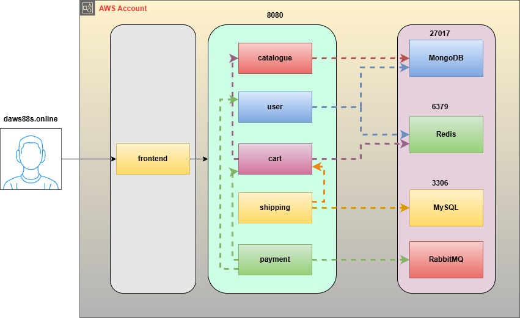

# RoboShop 3 Tier Architecture



RoboShop is an online robot store built from small services. Each service runs on its own EC2 server (RHEL 9) and is managed by `systemd`.

---

## Services, Ports and Versions

| Service | Port | Technology | Version |
|---------|------|------------|---------|
| Frontend | 80 | Nginx + React | nginx 1.26, React 19 |
| Catalogue | 8080 | Node.js | 24 |
| User | 8080 | Node.js | 24 |
| Cart | 8080 | Node.js | 24 |
| Shipping | 8080 | Java (Spring Boot 4) | OpenJDK 25, Maven 3.9 |
| Payment | 8080 | Python (Flask + gunicorn) | 3.14 |
| Dispatch | - | Go (consumer only) | 1.25 or newer |
| MongoDB | 27017 | NoSQL Database | 7.0 |
| Redis | 6379 | In-memory Cache | 7 |
| MySQL | 3306 | SQL Database | 8.4 |
| RabbitMQ | 5672 | Message Queue | 4.x |

> **MongoDB stays on 7.0.** MongoDB 8.0 crashes on the RHEL 9 practice AMI (`Fatal assertion 40379` at startup).

All versions come from the RHEL 9 AppStream repos, except MongoDB and RabbitMQ, which use their vendor repos. RHEL 9.8 or newer is needed for Python 3.14, and RHEL 9.7 or newer for Node.js 24, OpenJDK 25 and Go. Check with `cat /etc/redhat-release`.

---

## Setup Order

Databases first, then the backend services that use them, then the frontend.

**Databases**

1. [01-mongodb.md](01-mongodb.md)
2. [02-redis.md](02-redis.md)
3. [03-mysql.md](03-mysql.md)
4. [04-rabbitmq.md](04-rabbitmq.md)

**Backend**

5. [05-catalogue.md](05-catalogue.md)
6. [06-user.md](06-user.md)
7. [07-cart.md](07-cart.md)
8. [08-shipping.md](08-shipping.md)
9. [09-payment.md](09-payment.md)
10. [10-dispatch.md](10-dispatch.md)

**Frontend**

11. [11-frontend.md](11-frontend.md)

Once the frontend is up, the **System status** link at the top of the website shows which services are up.

---

## Artifacts

The application code is in the [artifacts](artifacts) folder of this repo. Each server downloads its zip directly from GitHub:

```
https://raw.githubusercontent.com/daws-92s/roboshop-documentation/refs/heads/main/artifacts/<name>-v4.zip
```

| Artifact | Contents |
|----------|----------|
| `frontend-v4.zip` | Built React website (HTML, JS, CSS, fonts, product images) |
| `catalogue-v4.zip` | Node.js code + `db/master-data.js` (products and a demo user) |
| `user-v4.zip` | Node.js code |
| `cart-v4.zip` | Node.js code |
| `shipping-v4.zip` | Java source + `db/master-data.sql` (cities) and `db/app-user.sql` |
| `payment-v4.zip` | Python code + `requirements.txt` |
| `dispatch-v4.zip` | Go source (`main.go`, `go.mod`, `go.sum`) |

The frontend Nginx config is [roboshop.conf](roboshop.conf).

> **Demo login:** user `roboshop`, password `RoboShop@1`. You can also register a new user on the website.

---

## Logs and Request Tracing

Every backend service writes one JSON line per request to the journal. Nginx creates a request id for each request and passes it to the backend services in the `X-Request-Id` header. Payment also puts it into the RabbitMQ message, so dispatch logs it too.

Find the id of a request in the browser (DevTools → Network → response header `X-Request-Id`), then search for it on every server:

```shell
journalctl -u catalogue | grep <request-id>
```

One checkout can be followed through frontend → shipping → cart → payment → user → cart → dispatch.

---

## Security Groups

> **Legend:**
> 🟡 SSH &nbsp;&nbsp; 🔴 Public Internet &nbsp;&nbsp; 🔵 Internal (Security Group)

---

### roboshop-mongodb

| # | Port | Protocol | Source | Description |
|---|------|----------|--------|-------------|
| 🟡 | 22 | TCP | MY-IP/32 | SSH access |
| 🔵 | 27017 | TCP | roboshop-catalogue | Catalogue reads products, loads master data |
| 🔵 | 27017 | TCP | roboshop-user | User reads/writes user accounts and orders |

---

### roboshop-redis

| # | Port | Protocol | Source | Description |
|---|------|----------|--------|-------------|
| 🟡 | 22 | TCP | MY-IP/32 | SSH access |
| 🔵 | 6379 | TCP | roboshop-user | Guest id counter |
| 🔵 | 6379 | TCP | roboshop-cart | Stores the carts |

---

### roboshop-mysql

| # | Port | Protocol | Source | Description |
|---|------|----------|--------|-------------|
| 🟡 | 22 | TCP | MY-IP/32 | SSH access |
| 🔵 | 3306 | TCP | roboshop-shipping | Shipping reads city/distance data, loads master data |

---

### roboshop-rabbitmq

| # | Port | Protocol | Source | Description |
|---|------|----------|--------|-------------|
| 🟡 | 22 | TCP | MY-IP/32 | SSH access |
| 🔵 | 5672 | TCP | roboshop-payment | Payment publishes orders |
| 🔵 | 5672 | TCP | roboshop-dispatch | Dispatch consumes orders |
| 🟡 | 15672 | TCP | MY-IP/32 | Management UI (optional) |

---

### roboshop-catalogue

| # | Port | Protocol | Source | Description |
|---|------|----------|--------|-------------|
| 🟡 | 22 | TCP | MY-IP/32 | SSH access |
| 🔵 | 8080 | TCP | roboshop-frontend | Frontend reverse proxy |
| 🔵 | 8080 | TCP | roboshop-cart | Cart checks product price and stock |

---

### roboshop-user

| # | Port | Protocol | Source | Description |
|---|------|----------|--------|-------------|
| 🟡 | 22 | TCP | MY-IP/32 | SSH access |
| 🔵 | 8080 | TCP | roboshop-frontend | Frontend reverse proxy |
| 🔵 | 8080 | TCP | roboshop-payment | Payment checks the user and saves the order |

---

### roboshop-cart

| # | Port | Protocol | Source | Description |
|---|------|----------|--------|-------------|
| 🟡 | 22 | TCP | MY-IP/32 | SSH access |
| 🔵 | 8080 | TCP | roboshop-frontend | Frontend reverse proxy |
| 🔵 | 8080 | TCP | roboshop-shipping | Shipping adds the shipping cost to the cart |
| 🔵 | 8080 | TCP | roboshop-payment | Payment empties the cart after the order |

---

### roboshop-shipping

| # | Port | Protocol | Source | Description |
|---|------|----------|--------|-------------|
| 🟡 | 22 | TCP | MY-IP/32 | SSH access |
| 🔵 | 8080 | TCP | roboshop-frontend | Frontend reverse proxy |

---

### roboshop-payment

| # | Port | Protocol | Source | Description |
|---|------|----------|--------|-------------|
| 🟡 | 22 | TCP | MY-IP/32 | SSH access |
| 🔵 | 8080 | TCP | roboshop-frontend | Frontend reverse proxy |

---

### roboshop-dispatch

| # | Port | Protocol | Source | Description |
|---|------|----------|--------|-------------|
| 🟡 | 22 | TCP | MY-IP/32 | SSH access |

> Dispatch is a RabbitMQ consumer. It only makes outbound connections, so it needs no inbound ports.

---

### roboshop-frontend

| # | Port | Protocol | Source | Description |
|---|------|----------|--------|-------------|
| 🟡 | 22 | TCP | MY-IP/32 | SSH access |
| 🔴 | 80 | TCP | 0.0.0.0/0 | HTTP from internet |

---
